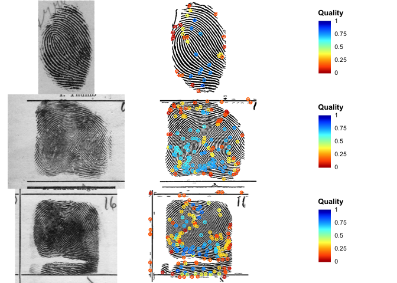
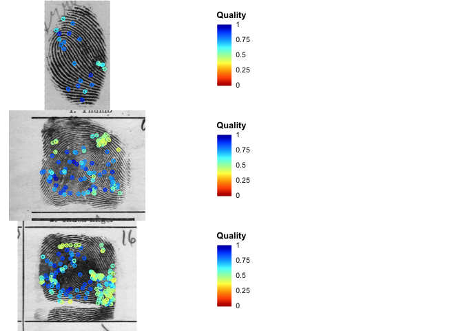

<!-- README.md is generated from README.Rmd. Please edit that file -->

# fingermatchR

<!-- badges: start -->

[](https://lifecycle.r-lib.org/articles/stages.html#experimental)
[](https://github.com/forensic-science/fingermatchR/actions)
<!-- badges: end -->

**fingermatchR** provides fingerprint matching tools based on NIST’s
MINDTCT and BOZORTH3 algorithms, as released in [NIST’s Biometrics Image
Software suite
(NBIS)](https://www.nist.gov/services-resources/software/nist-biometric-image-software-nbis).
It also provides R bindings to the [FingerJet minutiae extraction
tool](https://github.com/FingerJetFXOSE/FingerJetFXOSE).

## Installation

Make sure you have NBIS installed with binaries available in PATH. Check
in particular that you have the `mindtct` and `bozorth3` executables
installed and available:

``` bash
$ mindtct -version && bozorth3 -version
Standard Version: ANSI/NIST-ITL 1-2007
NBIS Non-Export Control Software Version: Release 5.0.0
...
```

You can install the development version of **fingermatchR** from
[GitHub](https://github.com/) with:

``` r
if (!require(devtools)) install.packages("devtools")
devtools::install_github("forensic-science/fingermatchR")
```

## Examples

``` r
library(fingermatchR)
library(dplyr)
```

Optionally, define location of NBIS executables:

``` r
# This is required if NBIS executables are not available in PATH.
#options(NBIS_bin = "/home/olivier/Desktop/Research/forensic-science/NBIS/src/bin")
options(NBIS_bin = "/usr/local/NBIS/bin")
```

### Minutiae detection

Detect minutiae using mindtct:

``` r
imgfiles = list.files("data-raw", pattern = "*.png", full.names = TRUE)

# Raw mindtct output
out = mindtct(imgfiles, outputdir="data-raw")
#> ℹ Running mindtct on 3 image files...
#> ✓ done running mindtct.

# Tidy minutiae descriptions
minutiae = tidyMinutiae(out)
```

Plot fingerprint image and its binarization with detected minutiae:

``` r
# Plain and rolled index fingerprints for the same individual
plotMinutiae(out[1:3, ])
```



### Match scores

Compute pairwise fingerprint match scores:

``` r
matchscores(out, outputdir = "data-raw")
#> # A tibble: 3 x 3
#>   score probe_index gallery_index
#>   <chr>       <int>         <int>
#> 1 3               1             2
#> 2 31              1             3
#> 3 7               2             3
```

Compute all-to-all fingerprint match scores between two lists:

``` r
matchscores(out, out, outputdir = "data-raw")
#> # A tibble: 9 x 3
#>   score probe_index gallery_index
#>   <chr>       <int>         <int>
#> 1 194             1             1
#> 2 3               1             2
#> 3 31              1             3
#> 4 3               2             1
#> 5 512             2             2
#> 6 7               2             3
#> 7 31              3             1
#> 8 7               3             2
#> 9 622             3             3
```

### Using the FingerJet minutiae extration tool

Detect minutiae using FingerJet:

``` r
imgfiles = list.files("data-raw", pattern = "*.png", full.names = TRUE)

# Raw mindtct output
fingerjet = fj_minutiae(imgfiles, outputdir="data-raw/fingerjet")
#> Running FingerJet minutiae extrator on 3 image files.
```

Plot fingerprint image and its binarization with detected minutiae:

``` r
# Plain and rolled index fingerprints for the same individual
plotMinutiae(fingerjet[1:3, ])
```



Compute pairwise fingerprint match scores:

``` r
matchscores(fingerjet, outputdir = "data-raw/fingerjet")
#> # A tibble: 3 x 3
#>   score probe_index gallery_index
#>   <chr>       <int>         <int>
#> 1 0               1             2
#> 2 22              1             3
#> 3 11              2             3
```

## References

-   Watson et al. (2007) [User’s Guide to Export ControlledDistribution
    of NIST Biometric Image Software
    (NBIS-EC)](https://nvlpubs.nist.gov/nistpubs/Legacy/IR/nistir7391.pdf).
    National Institute of Standards and Technology.
-   Watson et al. (2007) [User’s Guide to NIST Biometric Image Software
    (NBIS)](https://nvlpubs.nist.gov/nistpubs/Legacy/IR/nistir7392.pdf).
    National Institute of Standards and Technology.
