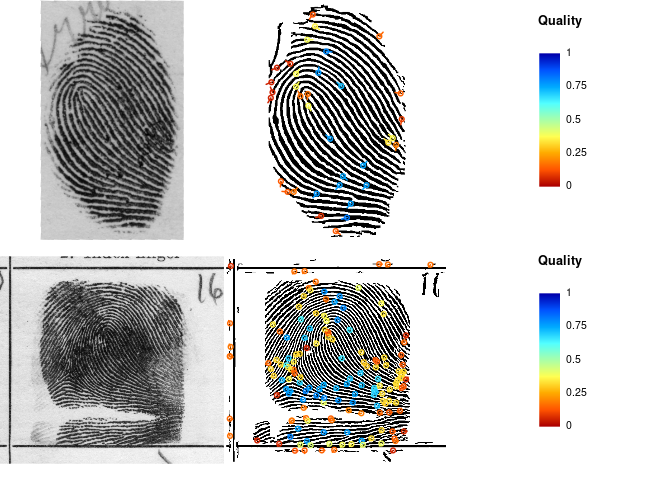

<!-- README.md is generated from README.Rmd. Please edit that file -->

# fingermatchR

<!-- badges: start -->

[](https://lifecycle.r-lib.org/articles/stages.html#experimental)
[](https://github.com/forensic-science/fingermatchR/actions)
<!-- badges: end -->

**FingermatchR** provides fingerprint matching tools based on NIST’s
MINDTCT and BOZORTH3 algorithms, as released in [NIST’s Biometrics Image
Software suite
(NBIS)](https://www.nist.gov/services-resources/software/nist-biometric-image-software-nbis).

## Installation

Make sure you have NBIS installed with binaries available in PATH. Check
in particular that you have the `mindtct` and `bozorth3` executables
installed and available:

``` bash
$ mindtct
  Usage : mindtct [-b] [-m1] <finger_img_in> <oroot>
        -b  = contrast boost image
        -m1 = output "*.xyt" according to ANSI INCITS 378-2004
        ...
$ bozorth3
  Usage:
   To compute match scores for fingerprint pairs:
        bozorth3 [options] probefile.xyt galleryfile.xyt [probefile galleryfile ...]
        ...
```

You can install the development version of **fingermatchR** from
[GitHub](https://github.com/) with:

``` r
if (!require(devtools)) install.packages("devtools")
devtools::install_github("forensic-science/fingermatchR")
```

## Examples

``` r
library(fingermatchR)
library(dplyr)
#> 
#> Attaching package: 'dplyr'
#> The following objects are masked from 'package:stats':
#> 
#>     filter, lag
#> The following objects are masked from 'package:base':
#> 
#>     intersect, setdiff, setequal, union
```

Define location of NBIS executables:

``` r
# This is required if NBIS executables are not available in PATH.
options(NBIS_bin = "/home/olivier/Desktop/Research/forensic-science/NBIS/src/bin")
```

Detect minutiae using mindtct:

``` r
imgfiles = list.files("data-raw", pattern = "*.png", full.names = TRUE)

# Raw mindtct output
out = mindtct(imgfiles, outputdir="data-raw")
#> Running mindtct on 3 image files.

# Tidy minutiae descriptions
minutiae = tidyMinutiae(out)
```

Plot fingerprint images with detected minutiae: N.B. this is not working
properly right now.

``` r
img <- imager::load.image("data-raw/00001000_plain_500_02.png")
par(mar=c(0,0,0,0))
plot(img, axes=FALSE)
df = minutiae %>% filter(source == "data-raw/00001000_plain_500_02.png")
points(df$x, df$y, col=2)
```



## References

-   Watson et al. (2007) [User’s Guide to NIST Biometric Image Software
    (NBIS)](https://nvlpubs.nist.gov/nistpubs/Legacy/IR/nistir7392.pdf).
    National Institute of Standards and Technology.
